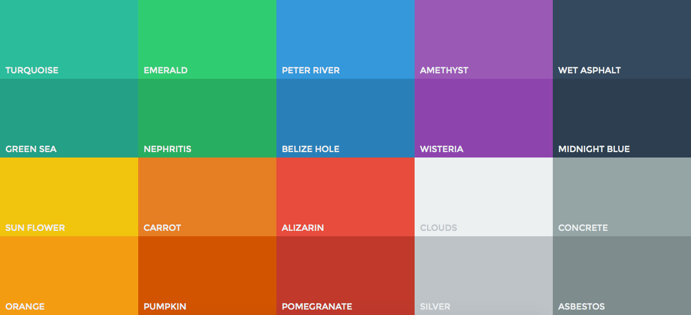
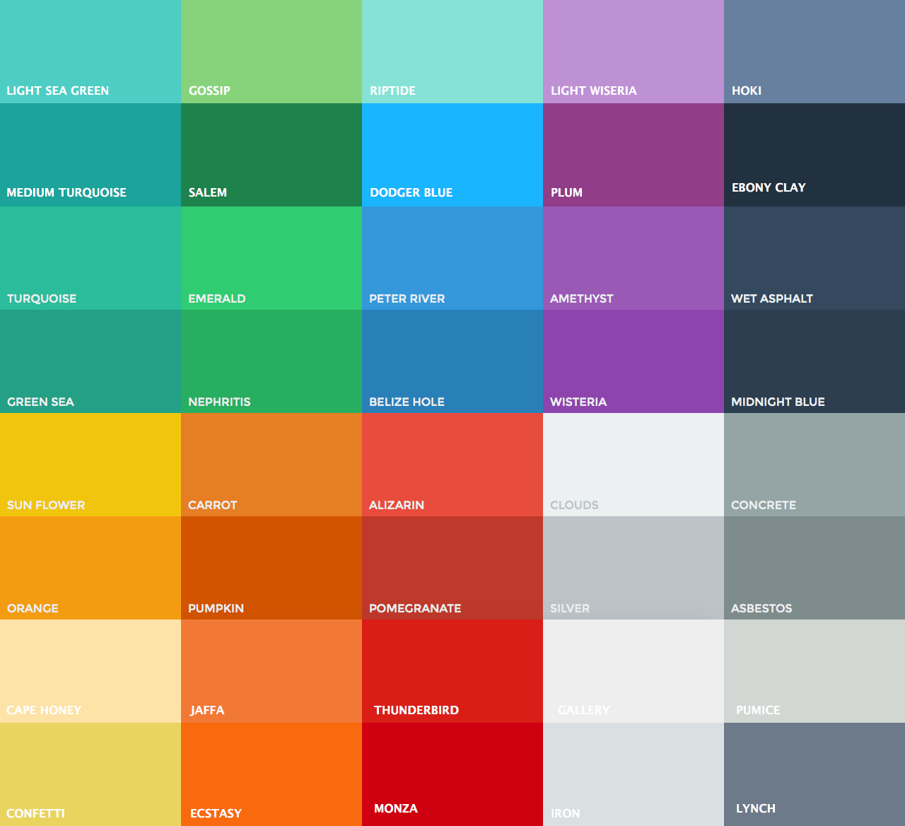

# Flat UI Color Palette for Xcode

FlatUI color palettes for Xcode. Restart Xcode after installation.  
Your palettes can be found in `~/Library/Colors/`.

#### Flat UI Colors

#### Extended Flat UI Colors

## Installation
    $ ./install.sh

## Uninstallation
    $ ./uninstall.sh